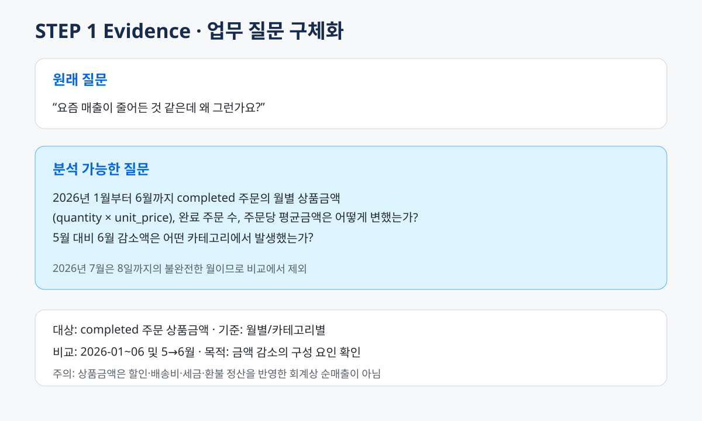
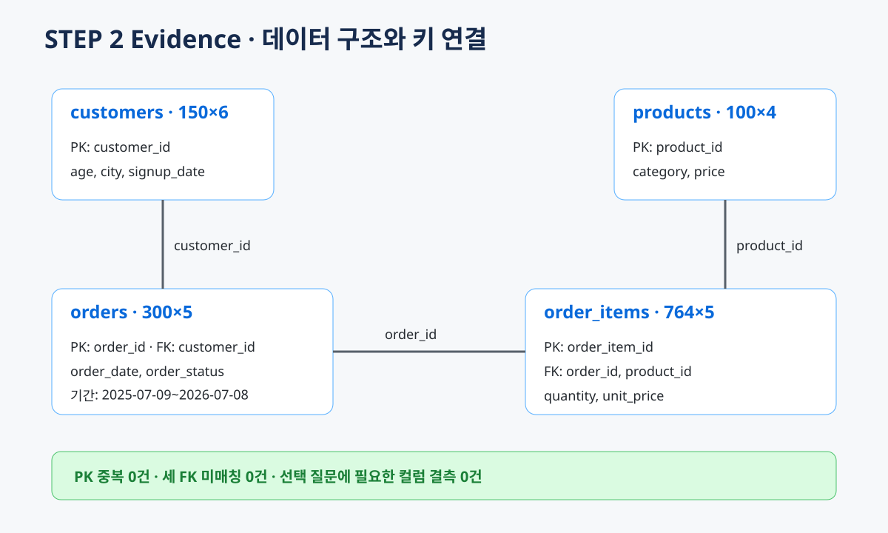
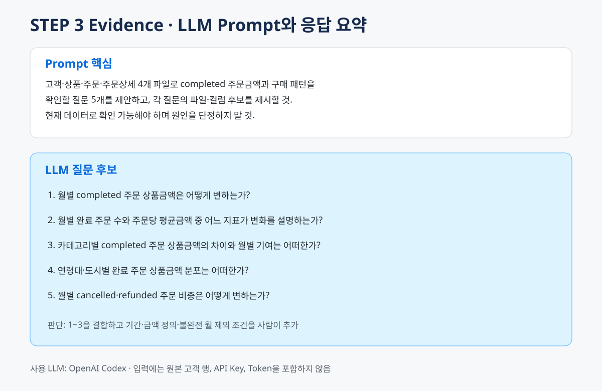
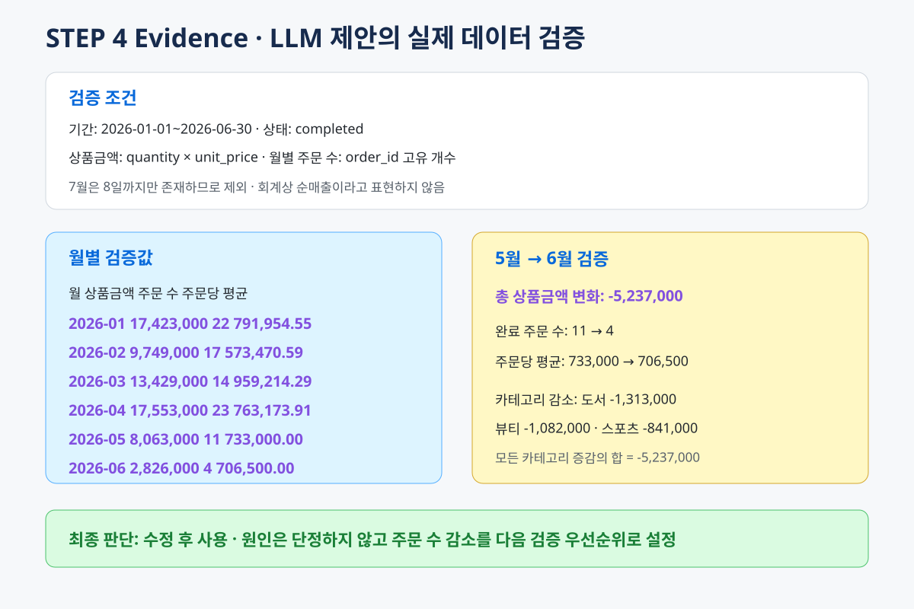
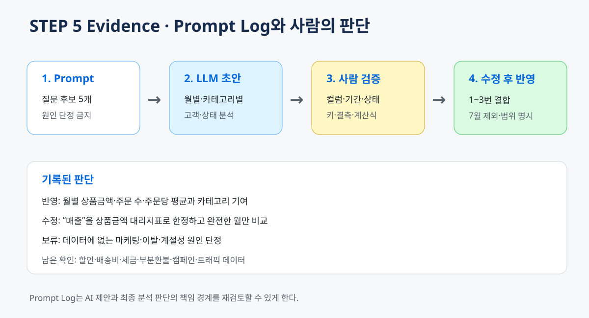
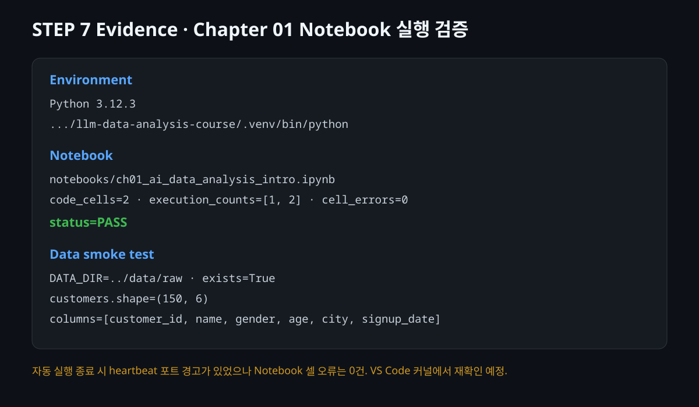

# Chapter 01. AI와 함께하는 데이터 분석의 시작

- 제출자/GitHub ID: `chocoemong1`
- 작성일: 2026-09-03
- 사용 LLM: OpenAI Codex

## 1. 질문 정의

**원래 질문**

> 요즘 매출이 줄어든 것 같은데 왜 그런가요?

대상·기간·금액 정의·비교 기준이 없고, 현재 데이터로 확인할 수 없는 원인까지 묻고 있어 다음과 같이 바꿨다.

**분석 질문**

> 2026년 1~6월 `completed` 주문의 월별 상품금액(`quantity × unit_price`), 완료 주문 수, 주문당 평균금액은 어떻게 변했는가? 5월 대비 6월 감소액은 어떤 카테고리에서 발생했는가?

- **결과 관찰:** 기간, 상태, 계산식, 집계 단위가 명확해졌다. 7월은 데이터가 8일까지뿐이라 제외했다.
- **나의 해석과 판단:** “왜”를 바로 단정하지 않고 주문 수·평균금액·카테고리 기여부터 확인하는 질문이 적절하다.
- **업무·분석적 의미:** 감소 원인을 조사할 때 어떤 추가 데이터를 먼저 요청할지 정할 수 있다.
- **한계:** 상품금액은 할인·배송비·세금·부분 환불을 반영한 회계상 순매출이 아니다.



## 2. 필요한 데이터

| 파일 | 필요한 컬럼 | 용도 |
| --- | --- | --- |
| `orders.csv` | `order_id`, `order_date`, `order_status` | 기간·상태 필터 |
| `order_items.csv` | `order_id`, `product_id`, `quantity`, `unit_price` | 상품금액 계산 |
| `products.csv` | `product_id`, `category` | 카테고리 분석 |
| `customers.csv` | `customer_id`, `age`, `city` | 후속 고객군 분석에만 사용 |

```text
customers.customer_id 1 ─ N orders.customer_id
orders.order_id       1 ─ N order_items.order_id
products.product_id   1 ─ N order_items.product_id
```

- **결과 관찰:** 데이터 크기는 고객 150행, 상품 100행, 주문 300행, 주문상세 764행이다. PK 중복과 세 FK 미매칭은 모두 0건이었다.
- **나의 해석과 판단:** 선택 질문은 `orders → order_items → products`로 계산할 수 있다. 주문 수는 상세 행 수가 아니라 `order_id` 고유 개수로 세야 한다.
- **한계:** 키가 연결된다는 사실만으로 전체 데이터 품질이 검증된 것은 아니다.



## 3. LLM 활용

**Prompt**

```text
온라인 쇼핑몰의 customers, products, orders, order_items 데이터가 있습니다.
completed 주문 상품금액과 구매 패턴을 이해할 질문 5개를 제안해 주세요.
각 질문에 필요한 파일과 컬럼도 적고, 데이터에 없는 원인은 단정하지 마세요.
실제 고객 행과 개인정보는 제공하지 않았습니다.
```

**답변 요약과 판단**

| LLM 제안 | 판단 |
| --- | --- |
| 월별 completed 상품금액 | 채택 |
| 월별 주문 수와 주문당 평균금액 | 채택 |
| 카테고리별 금액 기여 | 채택 |
| 연령대·도시별 구매 분포 | 후속 분석 |
| cancelled·refunded 비중 | 후속 분석 |

- **결과 관찰:** LLM은 시간·주문 구성·카테고리·고객군·상태 관점을 제안했지만 기간과 금액 정의는 정하지 않았다.
- **나의 해석과 판단:** 앞의 세 제안을 결합하되 완전한 월, 계산식, 주문 상태 조건을 사람이 추가해야 한다.
- **업무·분석적 의미:** LLM은 관점을 넓히는 초안 도구로 유용하지만 분석 범위의 최종 결정은 사람이 해야 한다.
- **한계:** 실제 컬럼·기간·키·집계식 검증 전에는 제안을 분석 결과로 사용할 수 없다.



## 4. LLM 제안 검증

| 검증 항목 | 확인 결과 |
| --- | --- |
| 데이터 기간 | 2025-07-09~2026-07-08 |
| 주문 상태 | completed 184, cancelled 64, refunded 52 |
| 분석 범위 | 2026-01-01~2026-06-30의 completed 주문 |
| 계산식 | `line_amount = quantity × unit_price` |
| 데이터 연결 | `many_to_one` 검증 통과, 필수 컬럼 결측 0건 |
| 최종 판단 | **수정 후 사용** |

월별 상품금액은 다음과 같았다.

```text
1월 17,423,000 → 2월 9,749,000 → 3월 13,429,000
→ 4월 17,553,000 → 5월 8,063,000 → 6월 2,826,000
```

| 5월 → 6월 | 변화 |
| --- | ---: |
| 상품금액 | 8,063,000 → 2,826,000 (`-5,237,000`) |
| 완료 주문 수 | 11 → 4 |
| 주문당 평균금액 | 733,000 → 706,500 |

- **결과 관찰:** 5→6월에는 주문당 평균금액보다 완료 주문 수가 크게 줄었고 모든 카테고리 금액이 감소했다. 도서(-1,313,000)와 뷰티(-1,082,000)의 감소액이 가장 컸다.
- **나의 해석과 판단:** 이 샘플에서는 주문 수 감소를 우선 확인해야 하지만, 6월 완료 주문이 4건뿐이므로 일반적 추세나 원인으로 확대할 수 없다.
- **업무·분석적 의미:** 유입·전환·재고·프로모션 데이터를 다음 검증 대상으로 정할 수 있다.
- **한계:** 가상 데이터이고 표본이 작으며 방문·광고·재고·취소 사유 데이터가 없다.



## 5. Prompt Log

| 항목 | 기록 |
| --- | --- |
| 사용 목적 | 분석 질문 후보 생성 |
| LLM 답변 | 월별·주문 구성·카테고리·고객군·상태 분석 제안 |
| 실제 반영 | 앞의 세 제안을 결합해 수정 후 사용 |
| 사람 검증 | 컬럼, 기간, 상태, 키, 결측, 계산식, 불완전 월 |
| 사람 수정 | 금액 정의, 1~6월 범위, 주문 수 단위, 원인 단정 제거 |
| 남은 확인 | 할인·환불·트래픽·전환·재고·프로모션 |

Prompt Log는 LLM의 제안과 사람의 검증·최종 판단을 구분하고 분석 변경 이유를 다시 확인하게 한다.



## 6. 보안 및 Notebook 확인

- [x] Prompt와 제출물에 실제 개인정보를 사용하지 않았다.
- [x] API Key·Token·Password·`.env` 실제 값을 포함하지 않았다.
- [x] 고객 개별 행 대신 공개 샘플의 스키마와 집계값만 사용했다.

공식 `ch01_ai_data_analysis_intro.ipynb`를 `.venv`의 Python 3.12.3으로 실행했다. 코드 셀 2개가 순서대로 실행됐고 셀 오류는 0건이었다. `customers.csv`는 `(150, 6)`으로 로드됐다. 이 Notebook은 본격 분석 결과가 아니라 라이브러리와 상대경로를 확인하는 starter scaffold다.

자동 실행 종료 중 heartbeat 포트 경고가 한 번 발생했으므로 Chapter 02에서 VS Code 커널이 같은 `.venv`를 가리키는지 다시 확인할 예정이다.



## 7. 최종 판단

LLM의 자연스러운 답변은 분석의 정답이 아니라 검증할 초안이다. 질문의 대상·기간·계산식·집계 단위를 사람이 정의하고 실제 데이터와 대조해야 한다. 이번에는 LLM 제안을 그대로 채택하지 않고 불완전한 7월을 제외하고 상품금액의 의미를 제한한 뒤 사용했다.

| 항목 | LLM의 역할 | 사람의 책임 |
| --- | --- | --- |
| 질문 | 후보 제안 | 목적·범위 확정 |
| 데이터·코드 | 점검 항목과 초안 제안 | 실제 스키마·계산식 검증 |
| 해석 | 문장 초안 | 수치 대조·과장 제거·최종 판단 |

**다음 확인:** Chapter 02에서 터미널과 Notebook의 `sys.executable`이 동일한 `.venv`를 가리키는지 확인한다.

## 제출 확인

- [x] 질문, Prompt, 검증 결과를 작성했다.
- [x] 관찰과 나의 해석·판단을 구분했다.
- [x] 업무적 의미와 한계를 작성했다.
- [x] Evidence 6개를 연결했다.
- [x] 개인정보와 Secret을 검사했다.
- [x] 수행 상태: **COMPLETE**

**최종 제출 URL**

https://github.com/chocoemong1/llm-data-analysis-study/blob/main/chapter01/chapter01.md
