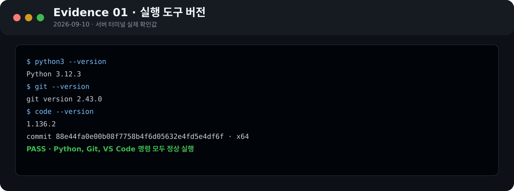
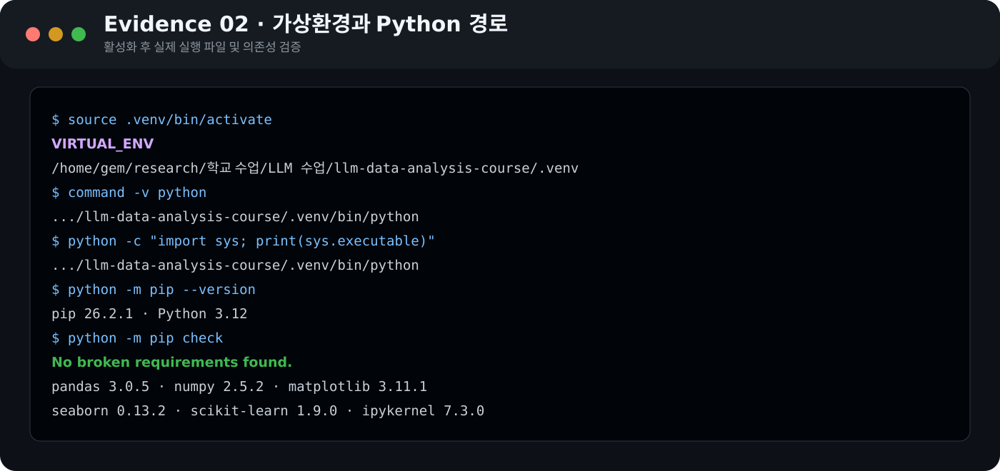
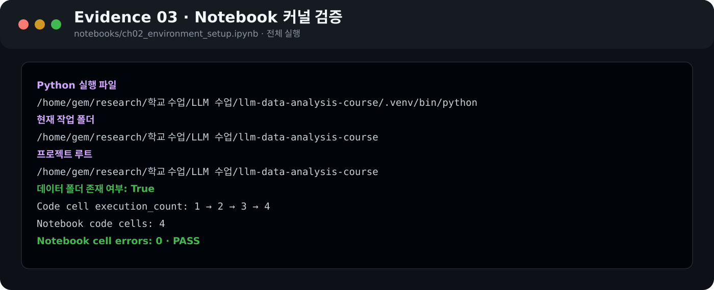
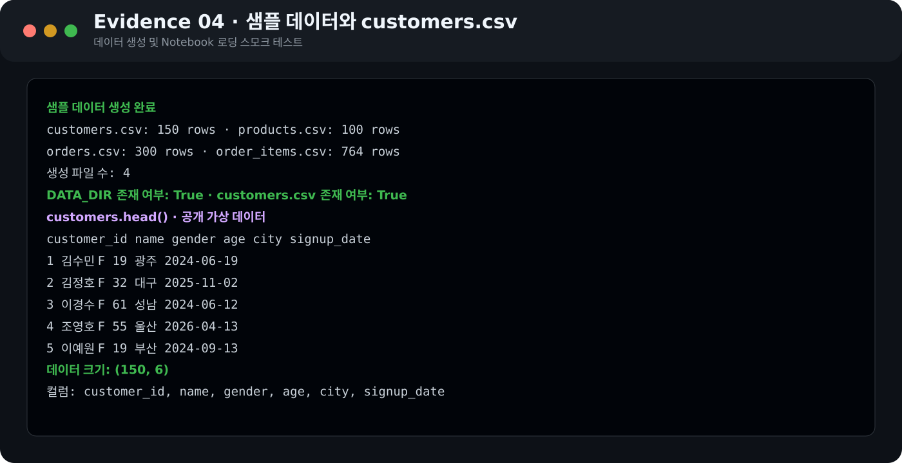
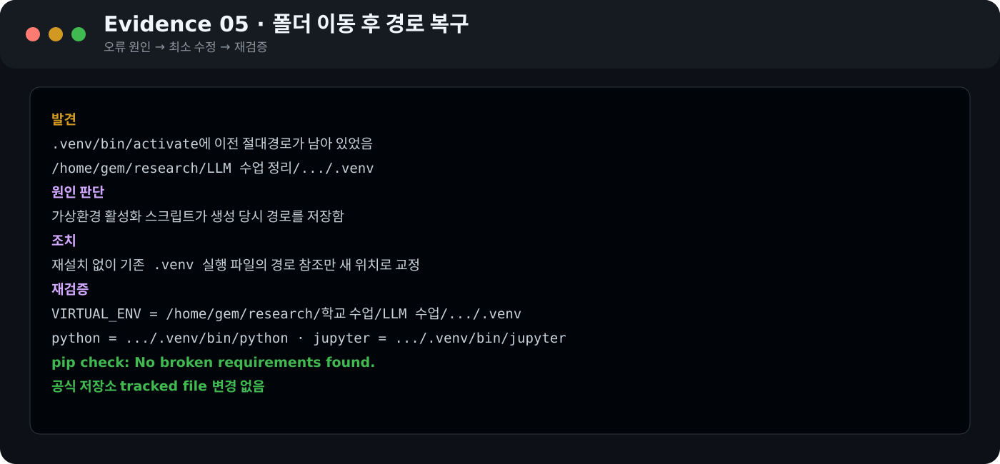

# Chapter 02. VS Code에서 시작하는 데이터 분석 환경

- 제출자/GitHub ID: `chocoemong1`
- 작성일: 2026-09-10
- 실행 환경: Linux x86_64 · VS Code Server

## 1. Python·Git·VS Code 확인

```bash
python3 --version
git --version
code --version
```

```text
Python 3.12.3
git version 2.43.0
VS Code 1.136.2 (x64)
```

- **결과 관찰:** 세 명령이 오류 없이 버전을 출력했다.
- **나의 해석과 판단:** 저장소 관리와 Python·Notebook 실행을 시작할 기본 도구가 준비됐다고 판단했다.
- **업무·분석적 의미:** 시작 전에 버전을 기록하면 환경 차이로 생긴 오류를 재현하기 쉽다.
- **한계:** 버전만으로 패키지·커널·데이터 경로의 연결까지 보장되지는 않는다.



## 2. 저장소와 `.venv` 준비

- [x] 기존 공식 Public 저장소와 원격 주소 확인
- [x] 원격·로컬 `main` 일치 확인 (`0 ahead / 0 behind`)
- [x] 프로젝트 루트의 `data/`, `notebooks/`, `scripts/`, `requirements.txt` 확인
- [x] 이동된 기존 `.venv`의 활성화 경로 교정
- [x] `python -m pip check` 통과

```text
프로젝트 루트: /home/gem/research/학교 수업/LLM 수업/llm-data-analysis-course
공식 원격: https://github.com/GilbertMoon/llm-data-analysis-course.git
활성화 후 Python: .../llm-data-analysis-course/.venv/bin/python
pip: 26.2.1
패키지 검증: No broken requirements found.
주요 패키지: pandas 3.0.5, numpy 2.5.2, matplotlib 3.11.1,
seaborn 0.13.2, scikit-learn 1.9.0, ipykernel 7.3.0
```

- **결과 관찰:** `VIRTUAL_ENV`, `command -v python`, `sys.executable`이 모두 현재 프로젝트의 `.venv`를 가리켰다.
- **나의 해석과 판단:** 시스템 Python과 수업 패키지가 분리되어 있고 의존성 충돌도 없어 이후 실습에 사용할 수 있다.
- **업무·분석적 의미:** 동일한 패키지 목록과 전용 환경은 실행 조건을 재구성하는 기준이 된다.
- **한계:** 운영체제나 Python 버전이 다르면 세부 동작이 달라질 수 있다.



## 3. VS Code 인터프리터와 Notebook 커널

공식 `notebooks/ch02_environment_setup.ipynb`를 프로젝트 `.venv`의 `python3` 커널로 전체 실행했다.

```text
VS Code Python 인터프리터: .../llm-data-analysis-course/.venv/bin/python
Notebook sys.executable:    .../llm-data-analysis-course/.venv/bin/python
Notebook Path.cwd():        .../llm-data-analysis-course
실행 순서: 1, 2, 3, 4
Notebook 셀 오류: 0
```

- **결과 관찰:** Notebook의 실제 Python과 작업 폴더가 현재 저장소 내부를 가리켰다.
- **나의 해석과 판단:** 터미널과 Notebook이 같은 환경을 사용하므로 패키지 불일치 문제를 줄일 수 있다.
- **업무·분석적 의미:** 커널 이름보다 실제 실행 경로를 확인하면 `ModuleNotFoundError` 원인을 빠르게 좁힐 수 있다.
- **한계:** 폴더를 다시 이동하면 활성화 스크립트의 경로를 재확인해야 한다.



## 4. 샘플 데이터와 Notebook 검증

기존 공식 데이터는 보존하고, 격리된 임시 경로에서 `generate_sample_data.py`를 재실행했다.

```text
customers.csv: 150 rows   products.csv: 100 rows
orders.csv: 300 rows      order_items.csv: 764 rows
생성 파일 수: 4
DATA_DIR 존재 여부: True
customers.csv 존재 여부: True
customers.shape: (150, 6)
컬럼: customer_id, name, gender, age, city, signup_date
```

- **결과 관찰:** 생성기는 CSV 4개를 만들었고 Notebook은 `customers.csv`를 `(150, 6)` DataFrame으로 읽어 `head()`와 `info()`를 출력했다.
- **나의 해석과 판단:** Python, pandas, 커널, 상대경로, CSV가 정상적으로 연결됐다.
- **업무·분석적 의미:** 본 분석 전 작은 로딩 테스트로 환경 문제와 분석 문제를 분리할 수 있다.
- **한계:** 환경 연결만 확인했으며 데이터 품질 평가는 Chapter 03에서 수행해야 한다.



## 5. 오류 해결 기록

| 항목 | 기록 |
| --- | --- |
| 증상 | 폴더 이동 후 `.venv/bin/activate`에 이전 경로가 남아 있었음 |
| 원인 | 활성화 스크립트가 생성 당시 절대경로를 저장함 |
| 확인 | 직접 Python 실행 → 활성화 파일 검색 → 이전 경로 발견 |
| 해결 | 재설치 없이 기존 `.venv` 실행 파일의 경로 참조만 교정 |
| 재검증 | `VIRTUAL_ENV`, Python, Jupyter가 새 경로를 가리키고 `pip check` 통과 |

환경 삭제나 시스템 설정 변경보다 범위가 작은 경로 교정을 선택했다. 다시 이동하면 같은 문제가 재발할 수 있어 `sys.executable`을 재확인해야 한다.



## 6. Secret 보호 확인

- [x] `.gitignore`가 `.venv/`, `.env`, `*.env`를 제외한다.
- [x] `.env`와 `.venv`는 Git 추적 대상이 아니다.
- [x] 예시 변수만 있는 `.env.example`만 추적된다.
- [x] 문서와 Evidence에 실제 API Key·Token·Password·개인정보가 없다.

실제 Secret이나 환경 전체가 Public GitHub에 올라가면 계정 악용과 정보 유출로 이어질 수 있으므로 개인 값은 환경변수로 분리해야 한다.


## 7. 최종 회고

가장 중요한 확인은 커널 이름이 아니라 `sys.executable`이 실제 `.venv`를 가리키는지 검증하는 것이다. 다음 Chapter에서도 아래 세 가지를 먼저 확인한다.

1. `sys.executable`과 `Path.cwd()`
2. `DATA_DIR.exists()`와 입력 파일 존재 여부
3. 핵심 패키지 import와 작은 데이터 로딩 테스트

자동 실행에서 공식 Notebook의 셀 ID 관련 향후 호환성 경고와 로컬 Jupyter 통신 경고가 있었지만 코드 셀 4개는 오류 없이 완료됐다. 경고는 실행 성공과 구분해 기록하고 공식 자료 갱신 여부를 확인한다.

## 제출 확인

- [x] 공식 Chapter 02 템플릿의 필수 항목을 반영했다.
- [x] 실행 결과와 Evidence 6개를 연결했다.
- [x] 관찰과 나의 해석·판단을 구분했다.
- [x] 오류 해결 과정과 재현성을 기록했다.
- [x] 개인정보와 Secret을 검사했다.
- [x] 수행 상태: **COMPLETE**

**최종 제출 URL**

https://github.com/chocoemong1/llm-data-analysis-study/blob/main/chapter02/chapter02.md
