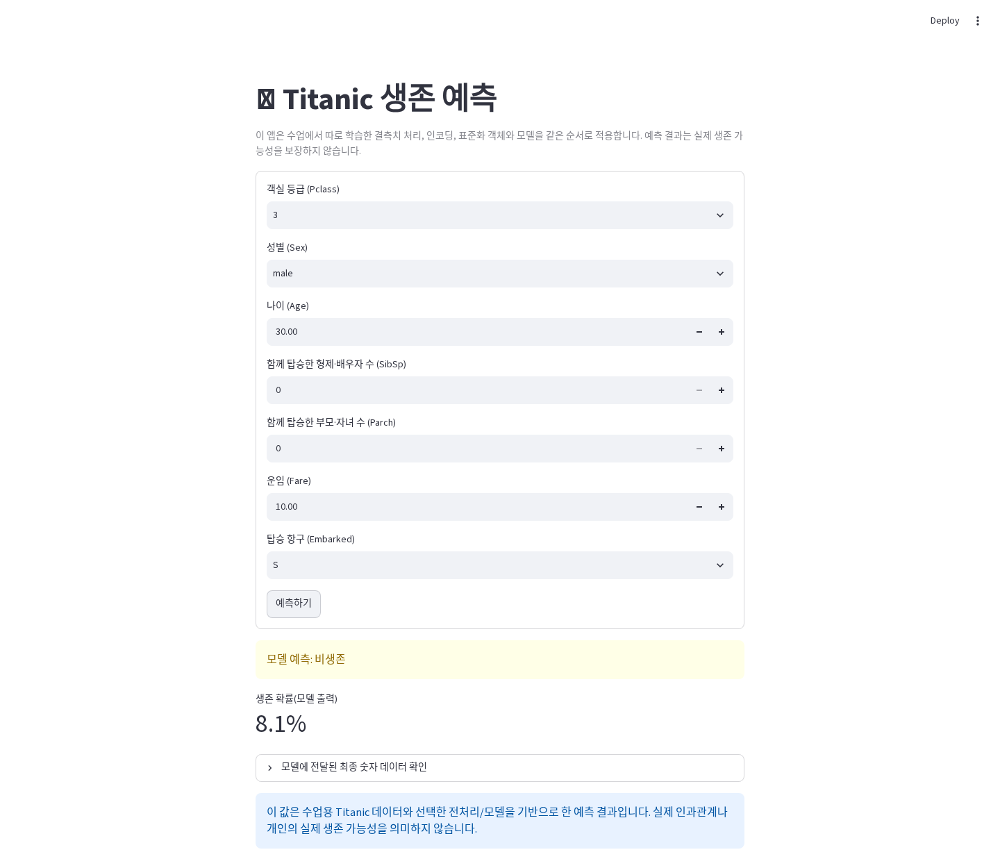

# Titanic AI Analysis

[특강 가이드](https://blog.naver.com/dev-dog/224408398762)의 STEP 00–17을 실행한 결과입니다.

## 결과

- 데이터: 891행 × 12열
- 분할: Train 712행 / Test 179행
- Logistic Regression: Accuracy 0.8156, F1 0.7402
- Random Forest: Accuracy 0.8101, F1 0.7258
- 최종 선택: Logistic Regression
- 예시 승객: class 0, 생존 확률 0.0813
- Notebook 전체 25개 코드 셀 및 Streamlit 폼 제출·health check 완료

주 결과와 관찰·해석·한계는 실행 완료된 [`titanic_ai_analysis.ipynb`](titanic_ai_analysis.ipynb)에 기록했습니다.

## 재실행

```bash
python scripts/prepare_titanic_data.py
jupyter notebook titanic_ai_analysis.ipynb
streamlit run src/titanic_app/app.py
```

`data/titanic/train.csv`는 고정된 pandas 공개 원본에서 재생성하며 저장소에는 커밋하지 않습니다. 출처와 무결성 기준은 [`data/titanic/SOURCE.md`](data/titanic/SOURCE.md)를 확인하세요.


